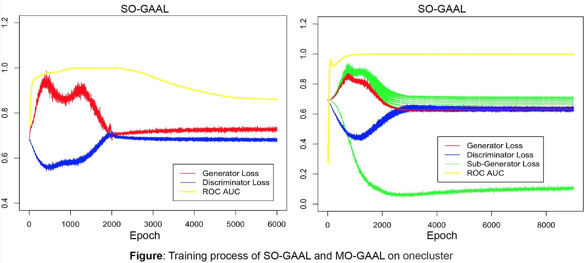

# Generative Adversarial Active Learning for Unsupervised Outlier Detection
Two GAAL-based outlier detection models: Single-Objective Generative Adversarial Active Learning (SO-GAAL) and Multiple-Objective Generative Adversarial Active Learning (MO-GAAL).

SO-GAAL directly generates informative potential outliers to assist the classifier in describing a boundary that can separate outliers from normal data effectively. Moreover, to prevent the generator from falling into the mode collapsing problem, the network structure of SO-GAAL is expanded from a single generator (SO-GAAL) to multiple generators with different objectives (MO-GAAL) to generate a reasonable reference distribution for the whole dataset.

This is our official implementation for the paper:

Liu Y , Li Z , Zhou C , et al. "Generative Adversarial Active Learning for Unsupervised Outlier Detection",	arXiv:1809.10816, 2018.

(Corresponding Author: [Dr. Xiangnan He](http://www.comp.nus.edu.sg/~xiangnan/))

If you use the codes, please cite our paper . Thanks!

## Environment
- Python 3.5
- Tensorflow (version: 1.0.1)
- Keras (version: 2.0.2)

## Quick Start


### Example to run the codes.
The instruction of commands has been clearly stated in the codes (see the parse_args function).

To launch the SO-GAAL quickly, you can use:
```
python SO-GAAL.py --path Data/onecluster --stop_epochs 1000 --lr_d 0.01 --lr_g 0.0001 --decay 1e-6 --momentum 0.9
```
or `./SO-GAAL.sh`  for short.


To launch the MO-GAAL quickly, you can use:
```
python MO-GAAL.py --path Data/onecluster --k 10 --stop_epochs 1500 --lr_d 0.01 --lr_g 0.0001 --decay 1e-6 --momentum 0.9
```
or `./MO-GAAL.sh`  for short.

### More Details:
Use `python SO-GAAL.py -h` or `python MO-GAAL.py -h` to get more argument setting details.

```shell
-h, --help            show this help message and exit
--path [PATH]         Input data path.
--k K                 Number of sub_generator.
--stop_epochs STOP_EPOCHS
                      Stop training generator after stop_epochs.
--lr_d LR_D           Learning rate of discriminator.
--lr_g LR_G           Learning rate of generator.
--decay DECAY         Decay.
--momentum MOMENTUM   Momentum.
```

## Dataset
We provide a synthetic dataset and four real-world datasets in Data/

synthetic dataset: onecluster

real-word datasets: Annthyroid, SpamBase, Waveform and WDBC

Update: December 5,  2018

